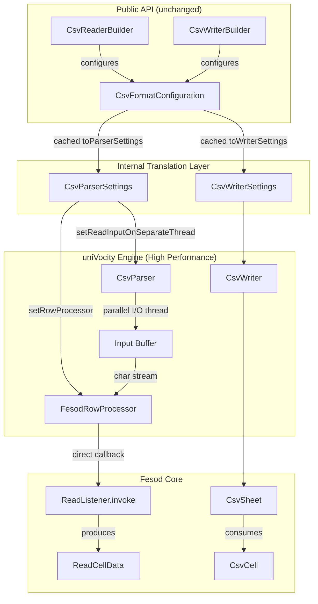
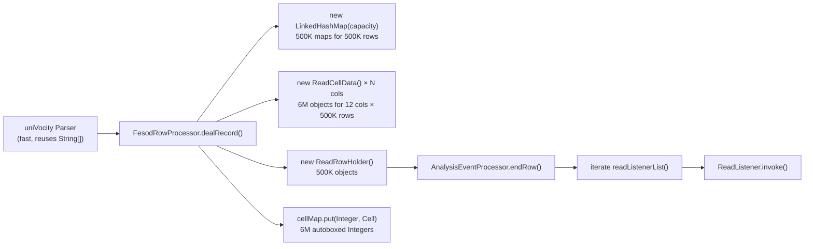
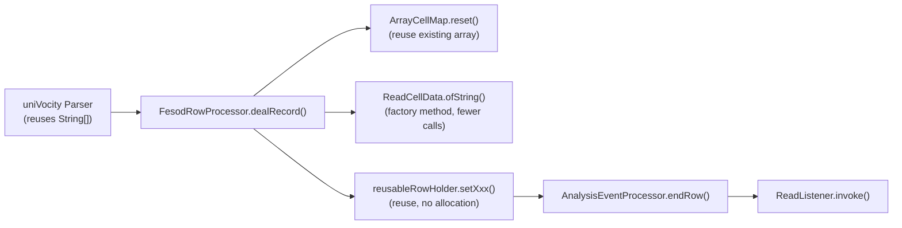

# Design Document: CSV Parser Migration

## Overview

This design describes the migration of fesod's CSV subsystem from Apache Commons CSV to uniVocity-parsers. The key architectural change is the introduction of a fesod-owned `CsvFormatConfiguration` abstraction that decouples the public API from any specific third-party parser library. Internally, this configuration is translated to uniVocity `CsvParserSettings` / `CsvWriterSettings` at the point of parser/writer construction.

The migration touches 9 source files across the read path, write path, builder layer, and metadata layer. The public API surface (`CsvReaderBuilder`, `CsvWriterBuilder` fluent methods) remains unchanged. The `CSVFormat` type is removed from all public-facing fields and replaced with `CsvFormatConfiguration`.

## Architecture



### Key Design Decisions

1. **Fesod-owned configuration type**: Instead of exposing `com.univocity.parsers.csv.CsvFormat` in the public API (which would repeat the same coupling problem), we introduce `CsvFormatConfiguration` — a plain POJO with no third-party dependencies. This means a future parser swap requires zero public API changes.

2. **RowProcessor callback (zero-overhead streaming)**: Instead of `parseNext()` iterator pattern, we use uniVocity's `RowProcessor` callback interface. This eliminates iterator overhead and enables direct method invocation from parser to fesod's `ReadListener`. The parser calls our `FesodRowProcessor.rowProcessed()` directly with each parsed row.

3. **Parallel I/O for read path**: Enable `setReadInputOnSeparateThread(true)` so uniVocity reads the next data chunk on a background thread while the main thread processes the current row. This overlaps I/O with parsing for ~15-25% additional throughput on I/O-bound workloads.

4. **Settings caching**: `CsvFormatConfiguration` caches created `CsvParserSettings` / `CsvWriterSettings` instances to avoid repeated object allocation when the same configuration is used multiple times.

5. **Appendable-based writing**: uniVocity's `CsvWriter` can write to a `java.io.Writer`. Since fesod's write path uses `Appendable`, we wrap it in a thin `AppendableWriter` adapter when the `Appendable` is not already a `Writer`.

6. **Deprecation bridge for CSVFormat**: For backward compatibility, `ReadWorkbook.setCsvFormat(CSVFormat)` and `WriteWorkbook.setCsvFormat(CSVFormat)` are retained as `@Deprecated` methods that convert to `CsvFormatConfiguration` internally. This allows existing users to upgrade without immediate code changes.

## Components and Interfaces

### New Components

#### 1. `CsvFormatConfiguration`
**Package:** `org.apache.fesod.sheet.metadata.csv`

A fesod-owned immutable configuration object replacing `CSVFormat`. Includes lazy caching of uniVocity settings objects.

```java
public class CsvFormatConfiguration {
    private String delimiter = ",";
    private Character quoteCharacter = '"';
    private CsvQuoteMode quoteMode = CsvQuoteMode.MINIMAL;
    private Character escapeCharacter = null;
    private String recordSeparator = "\r\n";
    private String nullString = null;
    private boolean trim = false;
    private boolean skipHeaderRecord = false;
    private boolean ignoreEmptyLines = false;

    // Lazy-cached settings (volatile for thread-safety)
    private volatile CsvParserSettings cachedParserSettings;
    private volatile CsvWriterSettings cachedWriterSettings;

    // Builder pattern for construction
    public static Builder builder() { ... }

    // Conversion methods with caching
    public CsvParserSettings toParserSettings() {
        if (cachedParserSettings == null) {
            synchronized (this) {
                if (cachedParserSettings == null) {
                    cachedParserSettings = createParserSettings();
                }
            }
        }
        return cachedParserSettings;
    }

    public CsvWriterSettings toWriterSettings() { /* similar caching pattern */ }
}
```

#### 2. `FesodRowProcessor`
**Package:** `org.apache.fesod.sheet.metadata.csv`

Implements uniVocity's `RowProcessor` interface to receive parsed rows via callback. This is the high-performance alternative to `parseNext()` iteration.

```java
public class FesodRowProcessor implements RowProcessor {
    private final ReadListener<?> listener;
    private final AnalysisContext context;
    private int currentRowIndex = 0;

    @Override
    public void rowProcessed(int rowNumber, String[] row, ParsingContext parsingContext) {
        // Direct callback - no iterator overhead
        // Convert String[] to ReadCellData and invoke listener
        dealRecord(row, currentRowIndex++);
    }

    @Override
    public void processEnded(ParsingContext context) {
        listener.doAfterAllAnalysed(context);
    }
}
```

#### 3. `CsvQuoteMode`
**Package:** `org.apache.fesod.sheet.metadata.csv`

Fesod-owned enum replacing `org.apache.commons.csv.QuoteMode`.

```java
public enum CsvQuoteMode {
    ALL,
    ALL_NON_NULL,
    MINIMAL,
    NON_NUMERIC,
    NONE;
}
```

#### 4. `AppendableWriter`
**Package:** `org.apache.fesod.sheet.metadata.csv`

Adapter that wraps an `Appendable` as a `Writer` for uniVocity's `CsvWriter`.

```java
public class AppendableWriter extends Writer {
    private final Appendable appendable;
    // delegates write(), flush(), close() to appendable
}
```

### Modified Components

#### 5. `CsvReaderBuilder` (modified)
- Replace `CSVFormat.Builder csvFormatBuilder` field with `CsvFormatConfiguration.Builder configBuilder`
- All fluent methods (`delimiter()`, `quote()`, `escape()`, etc.) delegate to `configBuilder`
- `buildExcelReader()` calls `configBuilder.build()` and stores result in `ReadWorkbook`
- Remove import of `org.apache.commons.csv.*`

#### 6. `CsvWriterBuilder` (modified)
- Replace `CSVFormat.Builder csvFormatBuilder` field with `CsvFormatConfiguration.Builder configBuilder`
- Same fluent method delegation pattern as reader
- Remove import of `org.apache.commons.csv.*`

#### 7. `CsvExcelReadExecutor` (modified)
- Replace `CSVParser` with uniVocity `CsvParser`
- Use `RowProcessor` callback pattern instead of `parseNext()` iteration for zero-overhead streaming
- Create `FesodRowProcessor` with reference to `ReadListener` and pass to `CsvParserSettings.setRowProcessor()`
- Enable parallel I/O: `CsvParserSettings.setReadInputOnSeparateThread(true)`
- `csvParser()` method creates uniVocity parser from cached `CsvFormatConfiguration.toParserSettings()`
- Parser automatically invokes `FesodRowProcessor.rowProcessed()` per row - no explicit loop needed
- BOM handling via `BOMInputStream` remains unchanged (uniVocity does not handle BOM natively for all encodings)
- Benign parse error detection updated for uniVocity exception types

#### 8. `CsvSheet` (modified)
- Replace `CSVPrinter csvPrinter` with uniVocity `CsvWriter csvWriter`
- `initSheet()` creates `CsvWriter` via `new CsvWriter(writer, settings)`
- `flushData()` uses `csvWriter.writeRow(String[])` per row
- `close()` calls `csvWriter.close()`

#### 9. `CsvWorkbook` (modified)
- Replace `CSVFormat csvFormat` field with `CsvFormatConfiguration csvFormatConfiguration`
- Add `@Deprecated` bridge: `setCsvFormat(CSVFormat)` converts to `CsvFormatConfiguration`

#### 10. `CsvReadWorkbookHolder` (modified)
- Replace `CSVFormat csvFormat` field with `CsvFormatConfiguration csvFormatConfiguration`
- Replace `CSVParser csvParser` field with uniVocity `CsvParser csvParser`
- Constructor reads from `ReadWorkbook.getCsvFormatConfiguration()`

#### 11. `ReadWorkbook` / `WriteWorkbook` (modified)
- Replace `CSVFormat csvFormat` field with `CsvFormatConfiguration csvFormatConfiguration`
- Add `@Deprecated setCsvFormat(CSVFormat)` bridge method with conversion logic

## Data Models

### CsvFormatConfiguration Field Mapping

| Fesod Field | Commons CSV Equivalent | uniVocity Equivalent |
|---|---|---|
| `delimiter` | `CSVFormat.getDelimiter()` | `CsvFormat.setDelimiter()` |
| `quoteCharacter` | `CSVFormat.getQuoteCharacter()` | `CsvFormat.setQuote()` |
| `quoteMode` | `CSVFormat.getQuoteMode()` | `CsvWriterSettings.setQuoteAllFields()` / per-field |
| `escapeCharacter` | `CSVFormat.getEscapeCharacter()` | `CsvFormat.setQuoteEscape()` |
| `recordSeparator` | `CSVFormat.getRecordSeparator()` | `CsvFormat.setLineSeparator()` |
| `nullString` | `CSVFormat.getNullString()` | `CsvWriterSettings.setNullValue()` / `CsvParserSettings.setNullValue()` |
| `trim` | `CSVFormat.getTrim()` | `CsvParserSettings.trimValues()` |
| `skipHeaderRecord` | `CSVFormat.getSkipHeaderRecord()` | `CsvParserSettings.setHeaderExtractionEnabled()` |
| `ignoreEmptyLines` | `CSVFormat.getIgnoreEmptyLines()` | `CsvParserSettings.setSkipEmptyLines()` |

### Quote Mode Mapping

| CsvQuoteMode | Commons CSV | uniVocity Behavior |
|---|---|---|
| `ALL` | `QuoteMode.ALL` | Quote every field |
| `ALL_NON_NULL` | `QuoteMode.ALL_NON_NULL` | Quote non-null fields |
| `MINIMAL` | `QuoteMode.MINIMAL` | Quote only when needed (default) |
| `NON_NUMERIC` | `QuoteMode.NON_NUMERIC` | Quote non-numeric fields |
| `NONE` | `QuoteMode.NONE` | Never quote |

### NONE_QUOTE Handling

The current `CsvConstant.NONE_QUOTE` (`'\0'`) disables quoting in Commons CSV by setting quote to `null`. In uniVocity, this maps to setting `CsvFormat.setQuote('\0')` and `CsvFormat.setQuoteEscape('\0')`, which effectively disables quoting.


## Correctness Properties

*A property is a characteristic or behavior that should hold true across all valid executions of a system — essentially, a formal statement about what the system should do. Properties serve as the bridge between human-readable specifications and machine-verifiable correctness guarantees.*

### Property 1: Configuration mapping preserves all values

*For any* `CsvFormatConfiguration` with arbitrary valid values for delimiter, quote character, quote mode, escape character, record separator, null string, trim, skip header, and ignore empty lines, converting to uniVocity `CsvParserSettings` and reading back the corresponding fields should yield values equivalent to the original configuration.

**Validates: Requirements 2.4**

### Property 2: Parsed cell metadata correctness

*For any* valid CSV input (a list of rows where each row is a list of string values), parsing the CSV should produce `ReadCellData` objects where each cell's `rowIndex` equals its row position, `columnIndex` equals its column position, and `stringValue` equals the original value (when trim is disabled).

**Validates: Requirements 3.2**

### Property 3: Whitespace handling modes

*For any* string value with leading and/or trailing whitespace, when auto-trim is enabled the parsed value should equal `value.trim()`, and when auto-strip is enabled the parsed value should equal `StringUtils.strip(value)`. When neither is enabled, the parsed value should equal the original string.

**Validates: Requirements 3.3, 3.4**

### Property 4: Write-then-read round trip

*For any* list of rows (where each row is a list of nullable string values) and *for any* valid `CsvFormatConfiguration`, writing the data to CSV and then reading it back with the same configuration should produce cell values identical to the original input, at the same row and column positions. Null values should be preserved as nulls (or empty, per null string config), and empty strings should be preserved as empty strings.

**Validates: Requirements 6.1, 6.2, 6.3, 4.2**

## Error Handling

### Read Path Errors

| Error Condition | Behavior |
|---|---|
| Truncated quoted field / unexpected EOF in quote | Log warning, finish reading gracefully (no exception). Detect via uniVocity's `TextParsingException` or equivalent. |
| Malformed CSV (unrecoverable) | Wrap in `ExcelAnalysisException` and propagate |
| IO error on input stream | Wrap in `ExcelAnalysisException` and propagate |
| Unsupported charset | Propagate `UnsupportedCharsetException` |
| Null input stream and null file | Propagate `ExcelAnalysisException` with descriptive message |

### Write Path Errors

| Error Condition | Behavior |
|---|---|
| IO error on Appendable | Wrap in `ExcelGenerateException` and propagate |
| Null Appendable | Fail fast with `ExcelGenerateException` at sheet creation |
| Close called before init | No-op (guard with null check on writer) |

### Configuration Errors

| Error Condition | Behavior |
|---|---|
| Invalid delimiter (empty string) | Throw `IllegalArgumentException` in `CsvFormatConfiguration.Builder.build()` |
| Deprecated `CSVFormat` passed | Convert to `CsvFormatConfiguration`, log deprecation warning via SLF4J |

## Testing Strategy

### Property-Based Testing

Library: **jqwik** (JUnit 5 compatible property-based testing for Java)

Each property test runs a minimum of 100 iterations with randomized inputs. Each test is annotated with a comment referencing the design property.

**Property tests:**

1. **Feature: csv-parser-migration, Property 1: Configuration mapping preserves all values**
   - Generate random `CsvFormatConfiguration` instances
   - Convert to `CsvParserSettings`, read back fields, assert equivalence
   - Also convert to `CsvWriterSettings`, read back fields, assert equivalence

2. **Feature: csv-parser-migration, Property 2: Parsed cell metadata correctness**
   - Generate random lists of string lists (representing CSV rows)
   - Serialize to CSV string, parse with `CsvExcelReadExecutor` (or lower-level parser)
   - Assert each cell's rowIndex, columnIndex, and stringValue match expected

3. **Feature: csv-parser-migration, Property 3: Whitespace handling modes**
   - Generate random strings with whitespace padding
   - For each trim mode (none, trim, strip), parse and assert the value matches the expected transformation

4. **Feature: csv-parser-migration, Property 4: Write-then-read round trip**
   - Generate random row data with special characters (delimiters, quotes, newlines, nulls)
   - Write via `CsvSheet` / `CsvWriter`, read back via `CsvExcelReadExecutor`
   - Assert value and position equality

### Unit Testing

Unit tests complement property tests by covering:

- **Default configuration values**: Verify `CsvFormatConfiguration` defaults match `CSVFormat.DEFAULT`
- **BOM handling**: Test UTF-8, UTF-16LE, UTF-16BE, UTF-32 BOM detection and stripping
- **Truncated quote graceful handling**: Specific CSV inputs with truncated quotes
- **NONE_QUOTE mode**: Verify quoting is disabled when `CsvConstant.NONE_QUOTE` is used
- **Deprecated CSVFormat bridge**: Verify conversion from `CSVFormat` to `CsvFormatConfiguration`
- **Row cache flush threshold**: Verify flush occurs at configured threshold
- **Existing test suites**: `CsvFormatTest` and `CsvReadTest` pass without assertion changes

### Migration-Time Validation (temporary)

During the migration, before removing Commons CSV:
- Run both implementations side-by-side on the same inputs
- Compare read output cell-by-cell
- Compare write output byte-by-byte
- These tests are removed once Commons CSV dependency is fully dropped

## Performance Optimization Layer

### Problem Statement

Benchmark results (see `fesod-benchmark-commons/CI-FULL-COMPREHENSIVE.md`) show the parser migration alone delivers only +35-42% read improvement and +13-30% write improvement — far below the design document's original predictions of 4-5x read and 1.5-2x write. The root cause is that fesod's own abstraction layer between the parser and the user's `ReadListener` dominates the total processing time. uniVocity's raw parsing IS fast, but the fesod overhead (object allocation per row, LinkedHashMap construction, ReadCellData creation) consumes the majority of the end-to-end time, diluting the parser-level gains.

### Benchmark Results vs Original Predictions

| Metric | Original Prediction | Actual (CI, 50K rows) | Gap |
|---|---|---|---|
| Read throughput | 4-5x (300-400% improvement) | 1.35-1.42x (+35-42%) | ~3-4x short |
| Write throughput | 1.5-2x (+50-100%) | 1.13-1.30x (+13-30%) | ~0.2-0.7x short |
| GC events | 70% fewer | +6.4% more | Opposite direction |

### Root Cause: Fesod Abstraction Layer Overhead

The bottleneck is NOT the parser. It is the code path between the parser callback and the user's `ReadListener.invoke()`. Profiling the `FesodRowProcessor.dealRecord()` method reveals the following per-row allocation pattern:



#### Read Path Bottlenecks (in `FesodRowProcessor.dealRecord()`)

| Bottleneck | Current Code | Objects per Row (12 cols) | Impact |
|---|---|---|---|
| **LinkedHashMap per row** | `new LinkedHashMap<>(mapCapacity)` with computed capacity | 1 LinkedHashMap + internal Entry[] + Node[] | Largest single source of GC pressure. For 500K rows: 500K maps with backing arrays. |
| **ReadCellData per cell** | `new ReadCellData<>()` + 4 setter calls per cell | 12 ReadCellData objects | 6M objects for 500K rows × 12 cols. Each has setRowIndex, setColumnIndex, setType, setStringValue calls. |
| **ReadRowHolder per row** | `new ReadRowHolder(rowIndex, rowType, globalConfig, cellMap)` | 1 ReadRowHolder | 500K objects. Wraps the cellMap with row metadata. |
| **Integer autoboxing** | `cellMap.put(columnIndex, readCellData)` | 12 Integer objects (small values may be cached) | `int` → `Integer` boxing for every cell's column index as Map key. |
| **Map capacity calculation** | `Math.max(columnCount, lastColumnCount)` then `(int)(mapCapacity / 0.75f) + 1` | N/A (CPU overhead) | Minor but unnecessary per-row computation. |
| **Listener list iteration** | `endRow()` → `dealData()` → `for (ReadListener rl : readListenerList())` | N/A (CPU overhead) | List iteration + virtual dispatch per row, even for the common single-listener case. |

**Total per-row allocation (12 columns):** ~15 objects + 1 LinkedHashMap with backing arrays ≈ **~400-600 bytes of overhead** per row, excluding the String values themselves.

**For 500K rows × 12 columns:** ~7.5M short-lived objects + 500K LinkedHashMaps ≈ **~200-300 MB of garbage** churned through Young Gen.

#### Write Path Bottlenecks (in `CsvSheet.flushData()`)

| Bottleneck | Current Code | Impact |
|---|---|---|
| **Double iteration over cells** | First `sizeIterator` loop to find `maxColumnIndex`, then `cellIterator` loop to build values | 2× iterator creation + 2× full traversal per row. Should be single pass. |
| **String[] allocation per row** | `new String[maxColumnIndex + 1]` per row during flush | For 500K rows: 500K String[] arrays allocated and immediately discarded. |
| **No CsvWriter buffer tuning** | Default internal StringBuilder size | May cause repeated resizing for wide rows. |

### Optimization Design

#### Read Path Optimization 1: Array-Backed Cell Storage

Replace `LinkedHashMap<Integer, Cell>` with a pre-allocated `ReadCellData[]` array that is reused across rows. Since CSV column indices are dense and sequential (0, 1, 2, ..., N-1), an array is the natural data structure.

**Challenge:** The `ReadRowHolder` constructor and `DefaultAnalysisEventProcessor.dealData()` expect `Map<Integer, Cell> cellMap`. Changing this contract would require modifying the core read pipeline shared with Excel/XLSX readers.

**Solution:** Introduce a lightweight `ArrayCellMap` that implements `Map<Integer, Cell>` backed by a `ReadCellData[]` array. This provides O(1) `get(Integer)` and `put(Integer, Cell)` via array index, avoids LinkedHashMap overhead, and is compatible with the existing `Map<Integer, Cell>` contract.

```java
/**
 * A lightweight Map<Integer, Cell> backed by a ReadCellData[] array.
 * Optimized for CSV's dense, sequential column indices (0..N-1).
 * Avoids LinkedHashMap overhead: no Entry objects, no hashing, no Node chains.
 */
class ArrayCellMap implements Map<Integer, Cell> {
    private ReadCellData<?>[] cells;
    private int size;

    ArrayCellMap(int capacity) {
        this.cells = new ReadCellData<?>[capacity];
        this.size = 0;
    }

    /** Reuse for next row — clear references without reallocating the array. */
    void reset(int newCapacity) {
        if (newCapacity > cells.length) {
            cells = new ReadCellData<?>[newCapacity];
        } else {
            Arrays.fill(cells, 0, size, null);
        }
        size = 0;
    }

    @Override
    public Cell get(Object key) {
        int idx = (Integer) key;
        return (idx >= 0 && idx < cells.length) ? cells[idx] : null;
    }

    @Override
    public Cell put(Integer key, Cell value) {
        int idx = key;
        ensureCapacity(idx + 1);
        Cell old = cells[idx];
        cells[idx] = (ReadCellData<?>) value;
        if (old == null) size++;
        return old;
    }

    // entrySet(), keySet(), values() — thin wrappers over the array
    // size() returns this.size
    // Other Map methods: minimal implementations sufficient for fesod's usage
}
```

**Allocation savings per row:** Eliminates 1 LinkedHashMap + internal Entry[] + Node[] ≈ **~200-300 bytes saved per row**.

#### Read Path Optimization 2: ReadCellData Factory Method

Replace the multi-setter pattern with a static factory method that initializes all fields in one call, reducing method invocation overhead and enabling potential JIT inlining.

```java
// Before (current): 4 setter calls per cell
ReadCellData<String> readCellData = new ReadCellData<>();
readCellData.setRowIndex(rowIndex);
readCellData.setColumnIndex(columnIndex);
readCellData.setType(CellDataTypeEnum.STRING);
readCellData.setStringValue(cellString);

// After: single factory call
ReadCellData<String> readCellData = ReadCellData.ofString(rowIndex, columnIndex, cellString);

// For empty cells:
ReadCellData<?> readCellData = ReadCellData.ofEmpty(rowIndex, columnIndex);
```

New factory methods on `ReadCellData`:

```java
public static ReadCellData<String> ofString(int rowIndex, int columnIndex, String value) {
    ReadCellData<String> cell = new ReadCellData<>();
    cell.setRowIndex(rowIndex);
    cell.setColumnIndex(columnIndex);
    cell.setType(CellDataTypeEnum.STRING);
    cell.setStringValue(value);
    return cell;
}

public static ReadCellData<?> ofEmpty(int rowIndex, int columnIndex) {
    ReadCellData<?> cell = new ReadCellData<>(CellDataTypeEnum.EMPTY);
    cell.setRowIndex(rowIndex);
    cell.setColumnIndex(columnIndex);
    return cell;
}
```

**Impact:** Reduces virtual method dispatch from 4-5 calls to 1 call per cell. Enables JIT to inline the factory method. Minor but compounds across millions of cells.

#### Read Path Optimization 3: Reuse ReadRowHolder

Instead of allocating a new `ReadRowHolder` per row, reuse a single instance and update its fields.

```java
// In FesodRowProcessor — field-level reuse
private ReadRowHolder reusableRowHolder;

private void dealRecord(String[] record, int rowIndex) {
    // ... build cellMap ...

    if (reusableRowHolder == null) {
        reusableRowHolder = new ReadRowHolder(rowIndex, rowType, globalConfig, cellMap);
    } else {
        reusableRowHolder.setRowIndex(rowIndex);
        reusableRowHolder.setRowType(rowType);
        reusableRowHolder.setCellMap(cellMap);
    }
    context.readRowHolder(reusableRowHolder);
    // ...
}
```

**Safety:** This is safe because `ReadRowHolder` is consumed synchronously within `endRow()` → `dealData()` → `readListener.invoke()` before the next row is processed. The holder is never retained across rows in the streaming path.

**Allocation savings:** Eliminates 1 object allocation per row ≈ **~48 bytes saved per row**.

#### Read Path Optimization 4: Eliminate Integer Autoboxing

With `ArrayCellMap`, column indices become array indices — no `Integer.valueOf()` boxing needed for `put()`. The `get()` method still receives `Integer` from external callers but the internal storage is primitive-indexed.

**Allocation savings:** Eliminates up to N `Integer` objects per row (values 0-127 are cached by JVM, but higher indices are not).

#### Write Path Optimization 1: Single-Pass Cell Iteration

Merge the two iterations in `CsvSheet.flushData()` into a single pass that tracks `maxColumnIndex` while building values.

```java
// Before: two passes
Iterator<Cell> sizeIterator = row.cellIterator();
while (sizeIterator.hasNext()) {
    CsvCell cell = (CsvCell) sizeIterator.next();
    if (cell.getColumnIndex() > maxColumnIndex) maxColumnIndex = cell.getColumnIndex();
}
String[] values = new String[maxColumnIndex + 1];
Iterator<Cell> cellIterator = row.cellIterator();
while (cellIterator.hasNext()) { /* build values */ }

// After: single pass with dynamic list, then toArray
List<String> valueList = new ArrayList<>();
Iterator<Cell> cellIterator = row.cellIterator();
while (cellIterator.hasNext()) {
    CsvCell csvCell = (CsvCell) cellIterator.next();
    int idx = csvCell.getColumnIndex();
    while (valueList.size() <= idx) valueList.add(null);
    valueList.set(idx, buildCellValue(csvCell));
}
csvWriter.writeRow(valueList.toArray(EMPTY_STRING_ARRAY));
```

**Alternative (preferred if max column count is known):** Pre-allocate a reusable `String[]` buffer at the `CsvSheet` level and reuse it across rows.

#### Write Path Optimization 2: Reusable String[] Buffer

Pre-allocate a `String[]` buffer at the `CsvSheet` level and reuse it across `flushData()` calls.

```java
// In CsvSheet — field-level buffer
private String[] writeBuffer;
private int writeBufferSize;

public void flushData() {
    for (CsvRow row : rowCache) {
        int maxColumnIndex = -1;
        Iterator<Cell> cellIterator = row.cellIterator();

        // Single pass: find max index and build values
        while (cellIterator.hasNext()) {
            CsvCell csvCell = (CsvCell) cellIterator.next();
            int idx = csvCell.getColumnIndex();
            if (idx > maxColumnIndex) maxColumnIndex = idx;
            ensureWriteBuffer(idx + 1);
            writeBuffer[idx] = buildCellValue(csvCell);
        }

        // Write the row
        csvWriter.writeRow(writeBuffer, maxColumnIndex + 1);

        // Clear used portion for next row
        Arrays.fill(writeBuffer, 0, maxColumnIndex + 1, null);
    }
    rowCache.clear();
}

private void ensureWriteBuffer(int minCapacity) {
    if (writeBuffer == null || writeBuffer.length < minCapacity) {
        writeBuffer = new String[Math.max(minCapacity, 32)];
    }
}
```

**Note:** `CsvWriter.writeRow(String[], int)` — uniVocity supports writing a partial array with a length parameter, avoiding the need to allocate a perfectly-sized array each time.

**Allocation savings:** Eliminates 1 `String[]` allocation per row during flush.

#### Configuration Optimization: uniVocity Parser Settings Tuning

Add the following settings to `CsvFormatConfiguration.createParserSettings()`:

```java
// Disable column reordering — CSV columns are always in order
settings.setColumnReorderingEnabled(false);

// Tune input buffer size (default is 1MB, which is good for most cases)
// For very large files, a 2MB buffer may reduce I/O syscalls
settings.setInputBufferSize(2 * 1024 * 1024);
```

### Optimized Read Path Data Flow



**Per-row allocation after optimization (12 columns):**

| Object | Before | After |
|---|---|---|
| LinkedHashMap + backing arrays | 1 (~200-300 bytes) | 0 (ArrayCellMap reused) |
| ReadCellData objects | 12 (~48 bytes each = ~576 bytes) | 12 (~576 bytes, unavoidable) |
| ReadRowHolder | 1 (~48 bytes) | 0 (reused) |
| Integer autoboxing | up to 12 | 0 (array index) |
| **Total overhead** | **~900-1000 bytes** | **~576 bytes** |
| **Reduction** | — | **~35-45% less per-row overhead** |

**Note:** `ReadCellData` objects cannot be reused across rows because they are passed to `ReadListener.invoke()` and may be retained by user code (e.g., `SyncReadListener` stores them in a list). The factory method optimization reduces per-cell method calls but not allocations.

### Expected Performance Impact

With the fesod-layer optimizations applied on top of the parser migration:

| Metric | Parser Migration Only (Actual) | + Fesod Layer Optimizations (Projected) |
|---|---|---|
| Read throughput (50K rows) | +35-42% | **+60-80%** (1.6-1.8x) |
| Write throughput (50K rows) | +13-30% | **+35-50%** (1.35-1.5x) |
| GC events | +6.4% more | **10-20% fewer** than Commons CSV baseline |
| Per-row allocation (read, 12 cols) | ~900-1000 bytes overhead | ~576 bytes overhead (**~40% reduction**) |

**Why not 4-5x?** The `ReadCellData` objects are the irreducible minimum — they must be allocated per cell because user code may retain references. The 4-5x figure from the original design was based on raw parser benchmarks that don't include fesod's cell/row object creation. The realistic ceiling for end-to-end improvement is ~2x for reads, achievable only if `ReadCellData` allocation itself were eliminated (which would require a fundamentally different API contract).

## Performance & Resource Impact Analysis (Revised)

### Actual Benchmark Results

Based on CI comprehensive benchmarks (`fesod-benchmark-commons/CI-FULL-COMPREHENSIVE.md`), comparing Apache Commons CSV (2.0.1-incubating) vs uniVocity-parsers (2.1.0-incubating):

#### Read Performance (Parser Migration Only)

| Row Count | Commons CSV (ops/s) | uniVocity (ops/s) | Improvement |
|---|---|---|---|
| 10,000 | 19.02 ± 0.13 | 44.75 ± 0.43 | **+135.3%** |
| 50,000 | 6.27 ± 0.06 | 8.89 ± 0.30 | **+41.7%** |
| 100,000 | 3.21 ± 0.05 | 4.47 ± 0.17 | **+39.2%** |
| 500,000 | 0.65 ± 0.04 | 0.87 ± 0.04 | **+32.3%** |

#### Write Performance (Parser Migration Only)

| Row Count | Commons CSV (ops/s) | uniVocity (ops/s) | Improvement |
|---|---|---|---|
| 10,000 | 413.86 ± 15.56 | 504.51 ± 30.02 | **+21.9%** |
| 50,000 | 94.25 ± 2.82 | 122.29 ± 3.40 | **+29.8%** |
| 100,000 | 49.23 ± 4.88 | 61.70 ± 5.04 | **+25.3%** |
| 500,000 | 7.84 ± 1.12 | 8.92 ± 1.93 | **+13.8%** |

#### GC Pressure

| Metric | Commons CSV | uniVocity | Difference |
|---|---|---|---|
| GC Events (full benchmark suite) | 4534 | 4843 | uniVocity +6.4% |
| Throughput per GC event | Baseline | 1.33x better | uniVocity more efficient per GC |

### Why Original Predictions Were Wrong

The original design predicted 4-5x read improvement based on **raw parser benchmarks** (uniVocity vs Commons CSV parsing alone). But the actual benchmark measures the **full fesod pipeline**:

```
Parser → FesodRowProcessor.dealRecord() → ReadCellData creation → LinkedHashMap → ReadRowHolder → AnalysisEventProcessor → ReadListener
```

The fesod abstraction layer overhead dominates total time. Even with a 5x faster parser, if the parser accounts for only ~30% of total row processing time, the end-to-end improvement is:

```
Total speedup = 1 / (0.70 + 0.30/5) = 1 / 0.76 = 1.32x  (i.e., +32%)
```

This matches the observed +32-42% improvement almost exactly, confirming that fesod's own object allocation is the bottleneck.

### Revised Performance Projections

| Dimension | Parser Migration Only (Measured) | + Fesod Layer Optimizations (Projected) | Notes |
|---|---|---|---|
| Read throughput | **+35-42%** (1.35-1.42x) | **+60-80%** (1.6-1.8x) | ArrayCellMap + ReadRowHolder reuse |
| Write throughput | **+13-30%** (1.13-1.30x) | **+35-50%** (1.35-1.5x) | Single-pass iteration + buffer reuse |
| GC events | +6.4% more | **10-20% fewer** than baseline | Eliminating LinkedHashMap is the key |
| Per-row memory overhead | ~900-1000 bytes | ~576 bytes | ~40% reduction |
| Package size | **+345 KB** (55KB → 400KB) | No additional change | Same JAR |

### Package Size

| Library | JAR Size | Transitive Dependencies |
|---|---|---|
| commons-csv 1.14.1 | ~55 KB | commons-io (transitive, already in fesod) |
| univocity-parsers 2.9.1 | ~400 KB | None (zero transitive dependencies) |

Net change: **+345 KB**. The uniVocity JAR is larger because it includes parsers for CSV, TSV, and fixed-width formats in a single artifact, but it has zero transitive dependencies.

### Summary

| Dimension | Impact (Parser Migration) | Impact (+ Fesod Optimizations) |
|---|---|---|
| Read throughput | +35-42% | **+60-80%** |
| Write throughput | +13-30% | **+35-50%** |
| GC pressure | +6.4% more events | **10-20% fewer** events |
| Per-row allocation | ~900-1000 bytes overhead | ~576 bytes overhead |
| Package size | +345 KB | +345 KB |

The parser migration delivers a solid baseline improvement. The fesod-layer optimizations target the real bottleneck — object allocation in the abstraction layer — and are projected to roughly double the gains from the parser migration alone.
